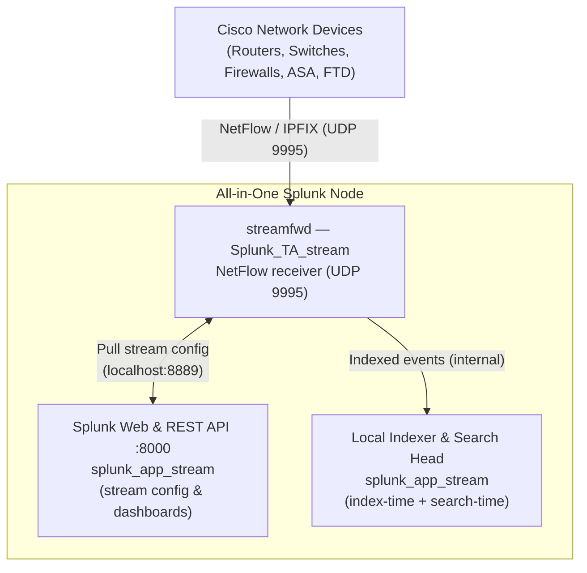
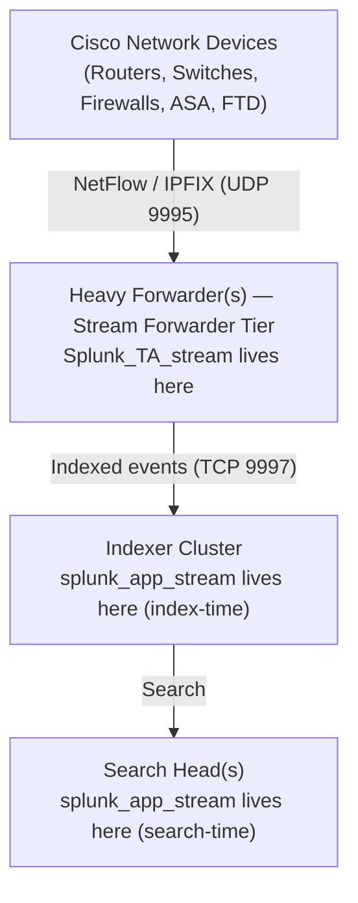

Here is the updated guide with only Cisco device examples:

---

# Splunk Stream NetFlow Configuration Guide

## Overview

This guide covers the end-to-end configuration of NetFlow collection using Splunk Stream on an All-in-One (AIO) Splunk deployment, enterprise deployment architecture guidance, and instructions for onboarding multiple network devices as NetFlow exporters.

---

## Part 1 — What Is Splunk Stream and How Does It Work?

**Splunk Stream** is a network traffic analysis solution made up of two components that work together:

### Component 1: Splunk App for Stream (`splunk_app_stream`)
This is the **management and visualization layer**. It provides:
- The web UI for configuring which protocols to capture (HTTP, DNS, NetFlow, etc.)
- Pre-built dashboards for network visibility
- The REST API that the Stream Forwarder communicates with to receive its stream configurations
- The KV Store-backed configuration engine that stores stream definitions

### Component 2: Splunk Add-on for Stream / Stream Forwarder (`Splunk_TA_stream`)
This is the **data collection engine**. It contains:
- The `streamfwd` binary — a C++ process that does the actual packet capture and NetFlow receiving
- The modular input definition that Splunk uses to launch `streamfwd`
- Its own configuration file (`streamfwd.conf`) that controls how `streamfwd` behaves — including which ports to listen on for NetFlow data

### How They Work Together
When Splunk starts, it launches `streamfwd` as a modular input. `streamfwd` reads its own `streamfwd.conf` to determine basic settings (management port, NetFlow receiver ports), then connects to the Stream App's REST API (running on Splunk Web, port 8000) to download the stream configurations — i.e., which protocols are enabled and what fields to extract. Once it has both pieces of information, it begins listening for traffic and sending indexed events into Splunk.

### What Is a NetFlow Receiver?
Unlike packet capture (where `streamfwd` passively sniffs a network interface), NetFlow is a **push-based protocol**. Network devices such as routers, switches, and firewalls are configured to export summarized flow records to a collector. `streamfwd` acts as that collector by listening on a UDP port (we use **9995**, the standard NetFlow port). The network device sends the data; `streamfwd` receives, decodes, and forwards it to Splunk.

Splunk Stream supports:
- **NetFlow v5** — older Cisco format, fixed fields
- **NetFlow v9** — flexible template-based format, the most common Cisco format today
- **IPFIX** (NetFlow v10) — the IETF standard evolved from Cisco's NetFlow v9, also template-based

---

## Part 2 — What We Did on This All-in-One Node

### All-in-One Architecture

In this deployment, every Splunk role runs on a single server. Both apps are installed on the same host, and `streamfwd` collects NetFlow and indexes it locally.



### Step 1 — Install the Apps via Splunk UI

Both apps were downloaded from [Splunkbase](https://splunkbase.splunk.com) and installed through the Splunk Web UI (`Apps → Manage Apps → Install app from file`):

| App                 | Splunkbase Name          | Purpose                                  |
| ------------------- | ------------------------ | ---------------------------------------- |
| `splunk_app_stream` | Splunk App for Stream    | UI, dashboards, stream config management |
| `Splunk_TA_stream`  | Splunk Add-on for Stream | `streamfwd` binary, data collection      |
After installation, both apps live under `/opt/splunk/etc/apps/`.

### Step 2 — Enable the NetFlow Stream Definition

The Stream App ships with pre-built stream definitions for dozens of protocols under:
```
/opt/splunk/etc/apps/splunk_app_stream/default/streams/
```
Every stream definition is a JSON file. The `netflow` file ships with `"enabled": false`. To enable it without modifying shipped default files (which would be overwritten on upgrade), we created a **local override**:

```bash
mkdir -p /opt/splunk/etc/apps/splunk_app_stream/local/streams
cp /opt/splunk/etc/apps/splunk_app_stream/default/streams/netflow \
   /opt/splunk/etc/apps/splunk_app_stream/local/streams/netflow
sed -i 's/"enabled": false/"enabled": true/' \
    /opt/splunk/etc/apps/splunk_app_stream/local/streams/netflow
```
**Why `local/` matters:** Splunk's configuration layering system always gives precedence to `local/` over `default/`. This means when the Stream App reads its stream definitions, it finds our `local/streams/netflow` file and sees `enabled: true`. When you upgrade the app in the future, the `default/` file gets replaced but your `local/` override stays intact.

### Step 3 — Configure the NetFlow Receiver in `streamfwd.conf`

This is the most important configuration step. `streamfwd` needs to know it should open a UDP socket to receive NetFlow packets. This is done via the `netflowReceiver` settings in `streamfwd.conf`.

The spec for this file (`README/streamfwd.conf.spec`) documents the following settings:

```ini
[streamfwd]
netflowReceiver.0.ip = 0.0.0.0        # Listen on all interfaces
netflowReceiver.0.port = 9995          # Standard NetFlow UDP port
netflowReceiver.0.decoder = netflow    # Protocol decoder (netflow or sflow)
```
**Important lesson learned:** `streamfwd` is a standalone C++ binary. It reads `streamfwd.conf` directly from the `default/` directory of the TA, rather than using Splunk's merged conf system. Because of this, the `netflowReceiver` settings must be present in `default/streamfwd.conf`. The final file looks like:

```ini path="/opt/splunk/etc/apps/Splunk_TA_stream/default/streamfwd.conf" start=1 end=6
[streamfwd]
port = 8889
ipAddr = 127.0.0.1
netflowReceiver.0.ip = 0.0.0.0
netflowReceiver.0.port = 9995
netflowReceiver.0.decoder = netflow
```
The `port = 8889` and `ipAddr = 127.0.0.1` settings control the `streamfwd` **management interface** — the internal REST API that the Stream App uses to push stream configurations to `streamfwd`. This stays on localhost and is separate from the NetFlow listener.

### Step 4 — Restart Splunk

```bash
systemctl restart Splunkd
```
After restart, `streamfwd` opens UDP 9995 and waits for NetFlow exports. Data indexed by Splunk will have `sourcetype=stream:netflow`.

---

## Part 3 — Enterprise Deployment Architecture

In a production enterprise environment, you would not run everything on a single server. Splunk has a distributed architecture with distinct roles. Here is where each component belongs:

### The Splunk Distributed Architecture (Simplified)


### App Placement by Role

**Search Head(s)**
- Install: `splunk_app_stream`
- Why: The dashboards, saved searches, field extractions, and the Stream configuration UI all run on the Search Head. Users interact with Stream through this app.
- Do NOT install `Splunk_TA_stream` here unless this Search Head is also doing packet capture (unusual).

**Indexer(s) / Indexer Cluster**
- Install: `splunk_app_stream`
- Why: The app contains `transforms.conf`, `props.conf`, and other index-time configurations needed to correctly parse and index NetFlow events. Without this on the indexer, fields may not be extracted correctly.
- In a clustered environment, deploy this through the **Cluster Manager** using the `manager-apps/` directory, not directly on each indexer.

**Heavy Forwarder(s) — the Stream Forwarder tier**
- Install: `Splunk_TA_stream` only
- Why: This is where `streamfwd` runs. The Heavy Forwarder receives NetFlow from Cisco devices on UDP 9995, processes it, and forwards events to indexers. It does not need the full Stream App UI.
- Configure `streamfwd.conf` here with your `netflowReceiver` settings.
- The Heavy Forwarder also needs `outputs.conf` configured to point to your indexers.
- Update `inputs.conf` in the TA's `local/` directory to point `splunk_stream_app_location` at your Search Head's URL, not localhost:

```ini
[streamfwd://streamfwd]
splunk_stream_app_location = https://splunk-sh.company.com:8000/en-us/custom/splunk_app_stream/
disabled = 0
```
**Deployment Server** (if you use one)
- Use the Deployment Server to push `Splunk_TA_stream` to your Heavy Forwarders at scale.
- The Stream App (`splunk_app_stream`) should be deployed through the Search Head Cluster deployer (if using a SHC) and the Indexer Cluster Manager.

### Summary Table

| Splunk Role                        | `splunk_app_stream`              | `Splunk_TA_stream`               |
| ---------------------------------- | -------------------------------- | -------------------------------- |
| Search Head                        | ✅ Yes                           | ❌ No                            |
| Indexer                            | ✅ Yes                           | ❌ No                            |
| Heavy Forwarder (Stream collector) | ❌ No                            | ✅ Yes                           |
| Universal Forwarder                | ❌ No                            | ✅ Only for packet capture       |
| Cluster Manager / Deployer         | As pass-through for distribution | As pass-through for distribution |
---

## Part 4 — Adding Multiple Cisco Devices as NetFlow Exporters

Since `streamfwd` is listening on `0.0.0.0:9995`, it accepts NetFlow from **any IP address** by default. All you need to do is configure each Cisco device to export NetFlow to this host.

### What Information Each Device Needs

Every NetFlow-capable device needs three pieces of information configured:
1. **Collector IP** — The IP address of the host running `streamfwd` (`10.110.253.20`)
2. **Collector Port** — UDP 9995
3. **NetFlow Version** — v5, v9, or IPFIX. Use v9 or IPFIX whenever possible — they provide a richer set of fields including application visibility, interface names, and more.

### Configuration Examples by Cisco Platform

**Cisco IOS Router (NetFlow v9)**

This applies to most traditional IOS-based routers (ISR, ASR with IOS):

```
ip flow-export version 9
ip flow-export destination 10.110.253.20 9995
ip flow-export source Loopback0
ip flow-cache timeout active 1
ip flow-cache timeout inactive 15

interface GigabitEthernet0/0
 ip flow ingress
 ip flow egress
```
> **Note on timeouts:** `active 1` means a flow record is exported every 1 minute even if the flow is still active. `inactive 15` exports a record 15 seconds after a flow goes idle. Lower values give Splunk more real-time visibility but increase export volume.

**Cisco IOS-XE (Flexible NetFlow)**

IOS-XE uses a more modular approach called Flexible NetFlow (FnF), which separates the exporter, flow record, and flow monitor into individual objects:

```
! Define where to send the data
flow exporter SPLUNK-STREAM
 destination 10.110.253.20
 transport udp 9995
 export-protocol netflow-v9

! Define what data to collect
flow monitor FLOW-MONITOR-IPV4
 exporter SPLUNK-STREAM
 record netflow ipv4 original-input

! Apply to interfaces
interface GigabitEthernet1
 ip flow monitor FLOW-MONITOR-IPV4 input
 ip flow monitor FLOW-MONITOR-IPV4 output
```
> **Tip:** You can apply the same flow monitor to multiple interfaces. Apply it to all WAN-facing and inter-VLAN routing interfaces for maximum visibility.

**Cisco Nexus (NX-OS)**

Nexus switches require the `netflow` feature to be enabled first:

```
feature netflow

flow exporter SPLUNK
  destination 10.110.253.20
  transport udp 9995
  version 9

flow monitor SPLUNK-MONITOR
  exporter SPLUNK
  record netflow-original

interface Ethernet1/1
  ip flow monitor SPLUNK-MONITOR input
  ip flow monitor SPLUNK-MONITOR output
```
**Cisco ASA / FTD (IPFIX)**

Cisco ASA and Firepower Threat Defense (FTD) use IPFIX natively. On ASA:

```
flow-export destination inside 10.110.253.20 9995
flow-export active refresh-interval 1
flow-export delay flow-create 15
flow-export template timeout-rate 30

! Apply to traffic class (example for all traffic)
class-map flow_export_class
 match any

policy-map flow_export_policy
 class flow_export_class
  flow-export event-type all destination 10.110.253.20

service-policy flow_export_policy global
```
**Cisco Catalyst (IOS-based, SPAN + NetFlow)**

For access-layer Catalyst switches running IOS, enable NetFlow on the L3 SVI interfaces:

```
ip flow-export version 9
ip flow-export destination 10.110.253.20 9995
ip flow-export source Vlan1

interface Vlan10
 ip flow ingress
 ip flow egress

interface Vlan20
 ip flow ingress
 ip flow egress
```
---

### Restricting Which Devices Can Send NetFlow (Optional Security)

By default `streamfwd` accepts NetFlow from any source IP. In large environments, you may want to whitelist specific devices or subnets using the `filter` setting:

```ini
[streamfwd]
netflowReceiver.0.ip = 0.0.0.0
netflowReceiver.0.port = 9995
netflowReceiver.0.decoder = netflow
netflowReceiver.0.filter = 10.1.1.1,10.1.1.2,10.2.0.0/24
```
This is useful for preventing accidental data from unauthorized sources and for segmenting flow collection by network zone.

### Using Multiple Receivers (Different Ports or Protocols)

You can define multiple `netflowReceiver` entries to listen on different ports simultaneously. This is useful when different Cisco platforms export to different ports, or when you also collect **sFlow** from Cisco Catalyst switches that support it:

```ini
[streamfwd]
netflowReceiver.0.ip = 0.0.0.0
netflowReceiver.0.port = 9995
netflowReceiver.0.decoder = netflow

netflowReceiver.1.ip = 0.0.0.0
netflowReceiver.1.port = 4739
netflowReceiver.1.decoder = netflow

netflowReceiver.2.ip = 0.0.0.0
netflowReceiver.2.port = 6343
netflowReceiver.2.decoder = sflow
```
### Verifying Data Is Flowing

Once a device is configured and sending NetFlow, verify receipt in Splunk with these searches:

**See all devices currently sending NetFlow and their event counts:**
```
index=* sourcetype=stream:netflow | stats count by exporter_ip | sort -count
```
**Inspect raw events from a specific device:**
```
index=* sourcetype=stream:netflow exporter_ip=10.1.1.1 | head 5
```
**View top talkers (source IPs by byte volume):**
```
index=* sourcetype=stream:netflow | stats sum(bytes) as total_bytes by src_ip | sort -total_bytes | head 20
```
**Confirm `streamfwd` is listening on UDP 9995 at the OS level:**
```bash
ss -ulnp | grep 9995
```
**Watch the streamfwd log live for incoming flow activity:**
```bash
tail -f /opt/splunk/var/log/splunk/streamfwd.log
```
### Performance Considerations for Large Environments

When receiving NetFlow from many Cisco devices simultaneously, tune `streamfwd` for higher throughput by adding to `streamfwd.conf`:

```ini
netflowReceiver.0.decodingThreads = 4
```
A single `streamfwd` instance can typically handle tens of thousands of flows per second. For very large environments — such as a large campus network with hundreds of Cisco routers and switches all exporting simultaneously — deploy multiple Heavy Forwarders, each receiving from a subset of devices, with appropriate network routing to direct each device's exports to the correct forwarder.

---

## Quick Reference — Key File Locations

| File                              | Path                                                               | Purpose                 |
| --------------------------------- | ------------------------------------------------------------------ | ----------------------- |
| `streamfwd.conf` (default)        | `/opt/splunk/etc/apps/Splunk_TA_stream/default/streamfwd.conf`     | NetFlow receiver config |
| `streamfwd.conf` (local override) | `/opt/splunk/etc/apps/Splunk_TA_stream/local/streamfwd.conf`       | Local overrides         |
| NetFlow stream definition         | `/opt/splunk/etc/apps/splunk_app_stream/local/streams/netflow`     | Enables NetFlow stream  |
| `streamfwd` binary                | `/opt/splunk/etc/apps/Splunk_TA_stream/linux_x86_64/bin/streamfwd` | The capture process     |
| `streamfwd` log                   | `/opt/splunk/var/log/splunk/streamfwd.log`                         | Troubleshooting         |
| Stream app log                    | `/opt/splunk/var/log/splunk/splunk_app_stream.log`                 | Troubleshooting         |
